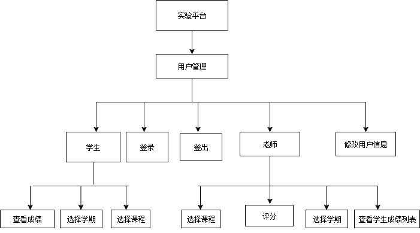
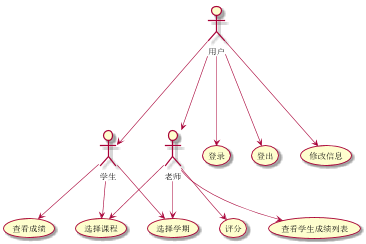
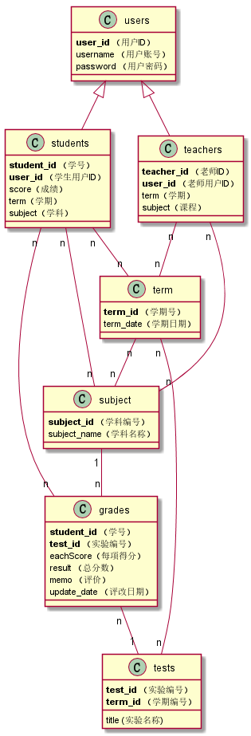

# 实验6：基于GitHub的实验管理平台的分析与设计
|学号|班级|姓名|照片|
|:-------:|:-------------: | :----------:|:---:|
|201510414120|软件(本)15-1|魏金冰||

## 1. 概述
- 基于GitHub的实验管理平台的作用是在线管理实验成绩的Web应用系统。学生和老师的实验内容均存放在GitHUB
页面上。
- 学生的功能主要有：设置自己的GitHub用户名和密码，之后可以进行登录和修改，登录后可看到自己的实验成绩，可以通过选择不同学期，不同课程查看其他学期和课程的成绩。点击一项实验成绩时，可以看到各个评分项的具体得分。
- 老师的功能主要有：以老师身份登录后，可以看到学生成绩列表和批改状态，可以对其进行评分和修改，可以通过选择不同学期，不同课程查看和修稿其他学期和课程的成绩。进入评分时为多项评分，并需要给出评语。
- 老师和学生都能通过本系统的链接方便地跳转到学生的每个GitHUB实验目录，以便批改实验或者查看实验情况。
- 实验成绩按数字分数计算，每项实验的满分为100分，最低为0分。
- 系统自动计算每个学生的所有实验的平均分。
    
## 2. 系统总体结构

界面设计参见：https://zwdbox.github.io/is_analysis/test6/ui/index.html
    
## 3. 用例图设计 [源码](src/yongli.puml)

## 4. 类图设计 [源码](src/leitu.puml)

## 5. 数据库设计
- ### [参见数据库设计](./数据库设计.md)

## 6. 用例及界面详细设计
- ### [“学生列表”用例](./用例/学生列表.md),[界面](https://zwdbox.github.io/is_analysis/test6/ui/index.html)
- ### [“评定成绩”用例](./用例/评定成绩.md),[界面](https://zwdbox.github.io/is_analysis/test6/ui/评定成绩.html)
- ### [“查看成绩”用例](./用例/查看成绩.md),[界面](https://zwdbox.github.io/is_analysis/test6/ui/查看成绩.html)
- ### [“修改密码”用例](./用例/修改密码.md),[界面](https://zwdbox.github.io/is_analysis/test6/ui/顶部菜单.html)
- ### [“修改用户信息”用例](./用例/修改用户信息.md),[界面](https://zwdbox.github.io/is_analysis/test6/ui/顶部菜单.html)
- ### [“查看用户信息”用例](./用例/查看用户信息.md),[界面](https://zwdbox.github.io/is_analysis/test6/ui/顶部菜单.html)
- ### [“登出”用例](./用例/登出.md),[界面](https://zwdbox.github.io/is_analysis/test6/ui/顶部菜单.html)
- ### [“登录”用例](./用例/登录.md),[界面](https://zwdbox.github.io/is_analysis/test6/ui/登录.html)
