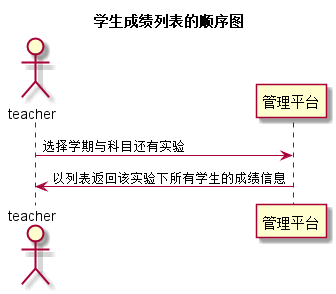

# “学生成绩列表”用例 [返回](../README.md)
## 1. 用例规约

|用例名称|学生成绩列表|
|-------|:-------------|
|功能|以表形式的显示出当前学期当前课程所有学生的实验成绩信息|
|参与者|老师|
|前置条件|老师需要先登录|
|后置条件| |
|主事件流| |
|备选事件流| |

## 2. 业务流程（顺序图） [源码](../src/studentlist.puml)
 

## 3. 界面设计
- 界面参照: https://A1078064378.github.io/is_analysis/test6/ui/teacher.html
- API接口调用
    - 接口1：[studentlist](../接口/studentlist.md) 

## 4. 算法描述

无
    
## 5. 参照表

- [STUDENTS](../数据库设计.md/#STUDENTS)
- [GRADES](../数据库设计.md/#GRADES)
- [TESTS](../数据库设计.md/#TESTS)
