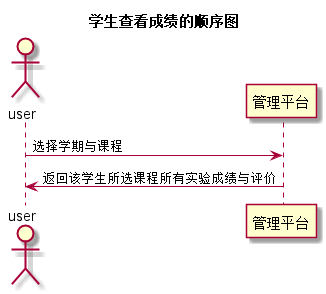

# “学生查看科目成绩”用例 [返回](../README.md)
## 1. 用例规约

|用例名称|学生查看科目成绩|
|-------|:-------------|
|功能|学生查看当前课程下的每个实验的实验成绩及实验评价|
|参与者|学生|
|前置条件|学生需要先登录并选取学期和课程|
|后置条件| |
|主事件流| |
|备选事件流| |

## 2. 业务流程（顺序图） [源码](../src/seescore.puml)
 

## 3. 界面设计
- 界面参照: https://A1078064378.github.io/is_analysis/test6/ui/student.html
- API接口调用
    - 接口1：[seescore](../interface/seescore.md) 

## 4. 算法描述
    无
    
## 5. 参照表
- [STUDENTS](../数据库设计.md/#STUDENTS)
- [GRADES](../数据库设计.md/#GRADES)
- [TESTS](../数据库设计.md/#TESTS)
