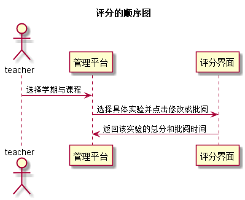

# “评分”用例 [返回](../README.md)
## 1. 用例规约

|用例名称|评分|
|-------|:-------------|
|功能|老师对一个学生的实验进行多项评分|
|参与者|老师|
|前置条件|评定成绩之前，老师需要先登录，选择一个学生的实验点击批改或修改|
|后置条件| 评定成绩提交之后，系统自动设置成绩更新日期为当前日期，自动计算总成绩|
|主流事件| 评定成绩|
|备注| |

## 2. 业务流程（顺序图） [源码](../src/pinfen.puml)
 

    
## 3. 界面设计
- 界面参照: 

- API接口调用

    - 接口1：[getNextPrevStudent](../接口/getNextPrevStudent.md)
        
        根据课程号取得上一个或者下一个学生的学号
        
    - 接口2：[getOneStudentResults](../接口/getOneStudentResults.md)
        
        用于显示一个学生的所有实验成绩和评语
         
    - 接口3：[setOneStudentResults](../接口/setOneStudentResults.md)
    
        用于设置一个学生的部分实验成绩和评语
    
## 4. 算法描述
    无
    
## 5. 参照表

- [STUDENTS](../数据库设计.md/#STUDENTS)
- [GRADES](../数据库设计.md/#GRADES)
- [TESTS](../数据库设计.md/#TESTS)
