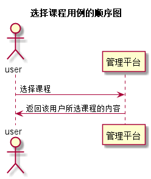

# “选择课程”用例 [返回](../README.md)
## 1. 用例规约
|用例名称|选择课程|
|-------|:-------------|
|功能|选择课程|
|参与者|学生，老师|
|前置条件|学生，老师需要先登录|
|后置条件| |
|主流事件| |
|备注| |

## 2. 业务流程（顺序图） [源码](../src/choosecourse.puml)
 

## 3. 界面设计
- 界面参照:https://A1078064378.github.io/is_analysis/test6/ui/student.html
- API接口调用
         - 接口1：[chooosecourse](../interface/choosecourse.md) 

## 4. 算法描述（活动图）
无

## 5. 参照表
- [STUDENTS](../数据库设计.md/#STUDENTS)
- [TEACHERS](../数据库设计.md/#TEACHERS)
- [SUBJECT](../数据库设计.md/#SUBJECT)
